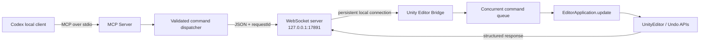
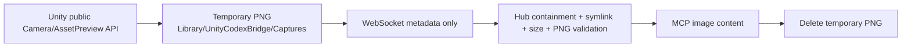

# Architecture

## Process boundaries

The Node.js process owns both the MCP stdio endpoint and the local WebSocket listener. These are separate adapters around the same typed command transport; there is no public generic `unity_execute` MCP tool.

Visual results take a deliberately separate bounded path:

## Hub responsibilities

- Load and strictly validate `config.json`.
- Bind WebSocket only to literal `127.0.0.1` and reject non-loopback peers defensively.
- Require a protocol-version handshake before accepting responses.
- Expose one semantic MCP tool per Unity action using the official TypeScript MCP SDK.
- Validate all MCP arguments with Zod before sending anything to Unity.
- Assign a UUID `requestId`, maintain the pending-request map, enforce timeout, and correlate the response.
- Reject pending requests when Unity disconnects, then accept the next connection after restart or Domain Reload.
- Preserve an authenticated active Unity connection until a replacement completes a valid v3 handshake.
- Convert only controlled generated captures into MCP image content after canonical-path, symlink, size, and PNG checks.
- Write concise logs to stderr and `logs/hub.log`; stdout is reserved exclusively for MCP stdio.

## Unity main-thread rule

`ClientWebSocket` runs in a background task. Its receive loop only parses bounded JSON and enqueues a plain `UnityCommandRequest`. It never reads or changes Scene objects.

`UnityBridgeBootstrap.OnEditorUpdate` drains at most 16 requests per Editor update and calls `UnityCommandExecutor`. Every use of `UnityEditor`, Scene objects, `SerializedObject`, `Undo`, or `EditorSceneManager` occurs on this main-thread path.

Responses contain plain dictionaries/lists/scalars. The executor serializes and places them in an outgoing queue; the background send loop transmits them.

## Reload and reconnect lifecycle

1. `[InitializeOnLoad]` schedules Bridge initialization.
2. The connection task attempts `ws://127.0.0.1:<port>` and retries after `reconnectDelayMs`.
3. On connection it sends `unity_hello`; Hub answers `hub_hello`.
4. `AssemblyReloadEvents.beforeAssemblyReload` cancels the old connection.
5. After compilation/reload, static initialization runs again and creates a new connection automatically.
6. The external Hub process remains alive throughout the Unity Domain Reload.

`unity_wait_for_ready` polls this lifecycle and succeeds only after a connected status reports neither compilation nor Asset Database update. `unity_wait_for_play_mode` uses the same reconnect-safe loop for Play Mode transitions.

## Undo strategy

- Create: `Undo.RegisterCreatedObjectUndo`.
- Delete: `Undo.DestroyObjectImmediate`.
- Transform: `Undo.RecordObject` before assignment.
- Add Component: `Undo.AddComponent`.
- Serialized property: `Undo.RecordObject` plus `SerializedObject.ApplyModifiedProperties`.
- Multi-item mutations: one named Undo group with per-item results.

Mutations mark the Scene dirty. During script compilation, mutating commands return `UNITY_COMPILING`.

## Security boundary

- Fixed loopback host; config rejects any other host.
- Explicit command allowlists in both TypeScript and C#.
- Per-tool schemas, bounded names/paths, finite numeric values, and 1 MiB payload default.
- Component resolution accepts only loaded concrete `UnityEngine.Component` subclasses.
- No shell/process API, eval, reflection-based method invocation, source-code input, remote listener, or model call.
- Generated PNGs are constrained to `Library/UnityCodexBridge/Captures` and removed after MCP delivery.

Asset creation/import/save and some Prefab/Terrain asset changes are not universally undoable in Unity. Those tools require explicit overwrite/discard choices and report the limitation rather than claiming Undo coverage.
